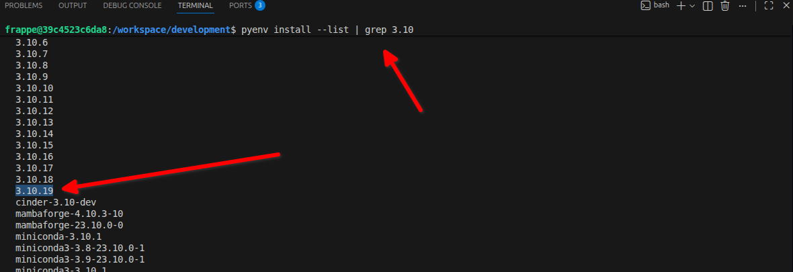

# Summary
This document helps to setup the `press` into your local machine and help's to work with your own `Frappe Cloud` for dev purpose.


### Step 1: setup frappe docker

setup the `frappe_docker`

Clone and change directory to frappe_docker directory

```shell
git clone https://github.com/frappe/frappe_docker.git
cd frappe_docker
```

Copy example devcontainer config from `devcontainer-example` to `.devcontainer`

```shell
cp -R devcontainer-example .devcontainer
```

Copy example vscode config for devcontainer from `development/vscode-example` to `development/.vscode`. This will setup basic configuration for debugging.

```shell
cp -R development/vscode-example development/.vscode
```

### Step 2: setup extention
Ignore the below step if its already installed

- Install Dev Containers for VSCode
  - through command line `code --install-extension ms-vscode-remote.remote-containers`
  - clicking on the Install button in the Vistual Studio Marketplace: [Dev Containers](https://marketplace.visualstudio.com/items?itemName=ms-vscode-remote.remote-containers)
  - View: Extensions command in VSCode (Windows: Ctrl+Shift+X; macOS: Cmd+Shift+X) then search for extension `ms-vscode-remote.remote-containers`
 
### Step 3: Setup Node
install `nvm` & `yarn`
```sh
nvm install v18
npm install -g yarn
nvm use v18
```

### Step 4: Setup python version
Get the right latest version of python-`3.10.x`

```
pyenv install --list | grep 3.10
```



for me the latest listed in the `pyenv` **3.10.19** so im choosing that version

```sh
pyenv uninstall 3.10.19
pyenv install 3.10.19
pyenv global 3.10.19
```


